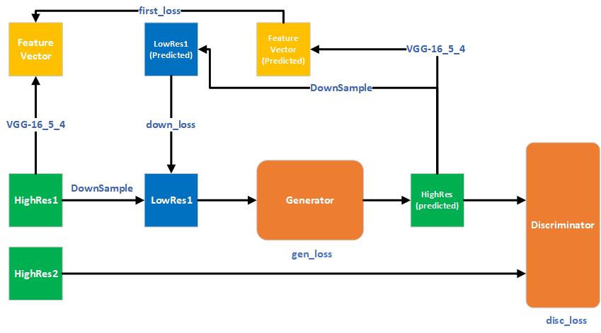
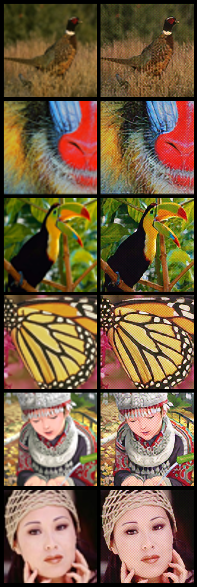

# DetailSuperResolution
Super resolution implementation with GAN

## Inctoduction
### Architecture


- disc_loss: recognize the fact that the HighRes2 is more realistic than the predicted HighRes.
- gen_loss: confuse the disc_loss.
- first_loss: reduce the square distance between the two feature maps.
- down_loss: reduce the square distance bwtween the two LosRes Images.

### Dataset
The training images are patches cut out from COCO_train2014 dataset.

The size of patches is 256 × 256 × 3.

The directory of the training images should be ```./datasets/train2014_patch```

### Reference

Ledig C, Theis L, Huszár F, et al. Photo-realistic single image super-resolution using a generative adversarial network[C]//Proceedings of the IEEE conference on computer vision and pattern recognition. 2017: 4681-4690.

Wang X, Yu K, Wu S, et al. Esrgan: Enhanced super-resolution generative adversarial networks[C]//Proceedings of the European Conference on Computer Vision (ECCV). 2018: 0-0.

Shi W, Caballero J, Huszár F, et al. Real-time single image and video super-resolution using an efficient sub-pixel convolutional neural network[C]//Proceedings of the IEEE conference on computer vision and pattern recognition. 2016: 1874-1883.

Johnson J, Alahi A, Fei-Fei L. Perceptual losses for real-time style transfer and super-resolution[C]//European conference on computer vision. Springer, Cham, 2016: 694-711.

## Results



